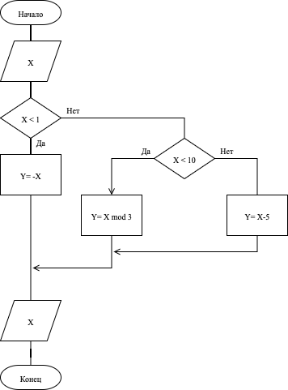

import CollatzTree from '../../../components/collatz/tree/Tree.jsx';
import CollatzFractal from '../../../components/collatz/fractal/Fractal.jsx';
import CollatzFractalExplanation from '../../../components/collatz/fractal/Explanation.mdx'

## Основные символы схем алгоритмов

### Терминатор
Начало, конец, прерывание процесса обработки данных или выполнения программы.
<svg xmlns="http://www.w3.org/2000/svg" width="320" height="120" viewBox="-3 -3 320 120" role="img">
    <path d="M 25 0 L 125 0 A 25 25 0 0 1 125 50 L 25 50 A 25 25 0 0 1 25 0"
          fill="none" stroke="var(--sl-color-white)" stroke-width="3"/>
</svg>

### Процесс
Выполнение операций или группы операций, в результате которых изменяется значение, форма представления или расположение данных.
<svg xmlns="http://www.w3.org/2000/svg" width="320" height="120" viewBox="0 0 320 120" role="img">
  <rect x="5" y="5" width="150" height="100" fill="none" stroke="var(--sl-color-white)" stroke-width="3"/>
</svg>

```cs
int a = 5;
int b = 10;
int c = a + b;
```

### Ввод/Вывод
Преобразование данных в форму, пригодную для обработки (ввод) или отображения результатов обработки (вывод).
<svg xmlns="http://www.w3.org/2000/svg" width="320" height="120" viewBox="0 0 320 120" role="img">
  <polygon points="30,5 180,5 155,100 5,100"
           fill="none" stroke="var(--sl-color-white)" stroke-width="3"/>
</svg>

```c#
Console.WriteLine();
Console.ReadLine();
```

### Решение
Выбор направления выполнения алгоритма или программы в зависимости от некоторых переменных условий.
<svg xmlns="http://www.w3.org/2000/svg" width="320" height="100" viewBox="-5 3 320 100">
  <polygon points="75,5 150,50 75,100 0,50"
           fill="none" stroke="var(--sl-color-white)" stroke-width="3"/>
</svg>
```cs
if (condition) {
    // code...
} else {
    // code...
}
```

### Подпрограмма
Вызов отдельной программы или подпрограммы, которая выполняет определённую функцию.
<svg xmlns="http://www.w3.org/2000/svg" width="320" height="100" viewBox="0 3 320 105">
  <rect x="5" y="5" width="150" height="100" fill="none" stroke="var(--sl-color-white)" stroke-width="3"/>
  <rect x="20" y="5" width="120" height="100" fill="none" stroke="var(--sl-color-white)" stroke-width="3"/>
</svg>
```C#
callFunction();
```

### Подготовка (Цикл)
Выполнение определённой последовательности действий для всех элементов.
Внутри блока: `имя_переменной=от, до`

<svg xmlns="http://www.w3.org/2000/svg" width="320" height="100" viewBox="0 -3 320 105">
  <polygon points="0,50 25,0 125,0 150,50 125,100 25,100"
           fill="none" stroke="var(--sl-color-white)" stroke-width="3"/>
</svg>

```cs
for (int i = 0; i < n; i++) {
    // code...
}
```

### Цикл (while / do while)
Повторение определённой последовательности действий, пока истинно заданное условие.
В случае с `while` условие пишется в первом символе, в случае с `do while` — в последнем.

- `while` - сначала проверка условия, потом тело цикла.
- `do while` - сначала тело цикла, потом проверка условия.

<svg xmlns="http://www.w3.org/2000/svg" width="320" height="180" viewBox="0 -5 320 200">
<polygon points="0,25 25,0 125,0 150,25 150,75 0,75" fill="none" stroke="var(--sl-color-white)" stroke-width="3"></polygon>
<polygon points="0,25 25,0 125,0 150,25 150,75 0,75" style="transform: rotate(180deg) translateY(-100px); transform-origin: 75px 37.5px;" fill="none" stroke="var(--sl-color-white)" stroke-width="3"></polygon>
</svg>

```cs
while (condition) {
    // code...
}
```
```cs
do {
    // code...
} while (condition);
```

### Комментарий
Дополнительная информация, поясняющая отдельные части схемы алгоритма.
<svg xmlns="http://www.w3.org/2000/svg" width="320" height="120" viewBox="0 0 320 120" role="img">
  <rect x="5" y="5" width="150" height="100" fill="none" stroke="var(--sl-color-white)" stroke-width="3" />
  <path d="M 210 5 L 200 5 L 200 110 L 210 110" stroke="var(--sl-color-white)" fill="none" stroke-width="3"/>
  <line x1="155" y1="55" x2="200" y2="55" stroke="var(--sl-color-white)" stroke-width="3" stroke-dasharray="4"/>
</svg>

```cs
int a = 10; // This is a comment
```

### Соединитель
Соединение частей схемы алгоритма, расположенных на одном или разных листах.
В местах соединения ставится одинаковый символ с одинаковой буквой или цифрой.

<svg xmlns="http://www.w3.org/2000/svg" width="320" height="180" viewBox="0 -5 320 200">
  <circle cx="30" cy="30" r="25" fill="none" stroke="var(--sl-color-white)" stroke-width="3"/>
</svg>

## Основные правила
- Схема алгоритма читается сверху вниз и слева направо.
- Схема начинается с символа [Терминатор](#терминатор) с надписью "Начало" и заканчивается символом "Терминатор" с надписью "Конец".
- Направление потока сверху вниз или слева направо считается стандартным. Это направление стрелками можно не обозначать. В случаях, когда необходимо внести большую ясность в схему (например, при изломах), на линиях могут использоваться стрелки. Если поток имеет направление, отличное от стандартного (снизу вверх и справа налево), то направление линии потока необходимо обозначать стрелкой.
- Линии потока должны подходить к символу либо слева, либо сверху, а исходить либо справа, либо снизу.
- Все символы должны быть примерно одинакового размера.
- Символ [Подготовка](#подготовка-цикл) имеет два входа и два выхода. Линии потока должны подходить к символу сверху и слева, а исходить снизу и справа.

## Задачи

### FizzBuzz
На вход подаётся число n. Если число делится на 3 — вывести «Fizz». Если делится на 5 — вывести «Buzz». Если делится и на 3, и на 5 — вывести «FizzBuzz». Иначе вывести само число.

### Сумма цифр числа
Напишите схему алгоритма, вычисляющего сумму цифр заданного натурального числа.

### Счастливый билет
Номера билетов в общественном транспорте состоят из шести цифр. Билет считается счастливым, если сумма первых трёх цифр равна сумме последних трёх. Напишите схему алгоритма, проверяющего, является ли билет с данным номером счастливым.

Если билет счастливый, выведите «Счастливый», иначе выведите «Обычный».

### Гипотеза Коллатца
На вход подаётся натуральное число n. Если оно чётное, то делим его на 2, если нечётное, то умножаем на три и прибавляем единицу. Гипотеза Коллатца состоит в том, что какое бы натуральное число мы не взяли, рано или поздно в результате применения этого преобразования мы получим единицу.
#### Визуализация в виде дерева

<details>
  <summary>
    Тык
  </summary>
  <div>
    <CollatzTree client:visible/>
  </div>
</details>

#### Визуализация в виде фрактала
<details>
  <summary>
    Тык
  </summary>
  <div>
    <CollatzFractal client:visible/>
  </div>
  <details>
    <summary>
      Теория
    </summary>
    <div>
      <CollatzFractalExplanation />
    </div>
  </details>
</details>

### Биологическая
Цепочка ДНК состоит из четырёх нуклеотидов:
- аденин (A);
- цитозин (C);
- гуанин (G);
- тимин (Т).

Цепь РНК состоит также из четырёх нуклеодитов:
- A;
- C;
- G;
- Урацил (U).

Цепь РНК строится на основе цепи ДНК последовательной заменой комплементарных
нуклеотидов:

|ДНК|РНК|
|---|---|
|G  | C |
| C | G |
| T | A |
| A | U |

Напишите схему алгоритма, переводящего цепь ДНК в цепь РНК.

### Максимумы двух последовательностей
Напишите алгоритм программы, принимающей на вход две последовательности и выводящей последовательность элементов, у которой на каждой позиции стоит максимальный из соответствующих элементов этих двух последовательностей.

### Проверка коллинеарности точек
Напишите алгоритм программы, принимающей на вход координаты заданного конечного количества точек на плоскости, и выводящей сообщение «YES», если все эти точки лежат на одной прямой, либо «NO» в противном случае.

### Железнодорожный сортировочный узел
Пусть есть железнодорожный сортировочный узел с тремя сортировочными операциями: «мимо», «в тупик» и «из тупика». На входе черные и белые вагоны: вагонов каждого цвета n штук.  Подготовьте схему алгоритма, чтобы составить вагоны в чередующемся порядке, то есть за белым вагоном всегда должен следовать чёрный вагон, и, наоборот, за чёрным всегда должен следовать белый.

### Анализ схемы алгоритма
На основе следующей схемы алгоритма напишите выход алгоритма для входных данных: -2, 4, 12

Ответ введите в форму: https://forms.gle/f2ehDQm9wBjCLGWk6



## Материалы
1. [ГОСТ 19.701-90. Схемы алгоритмов, программ, данных и систем. Условные обозначения и правила выполнения](https://www.edsd.ru/files/pdf/GOST-19.701-90.-Shemy-algoritmov-programm-dannyh-i-sistem.-Uslovnye-Oboznacheniya-i-pravila-vypolneniya.pdf)
2. [diagrams.net. Онлайн-редактор диаграмм](https://app.diagrams.net/)
3. [Codewars. Платформа для тренировки программирования](https://www.codewars.com/)
4. [LeetCode. Платформа для подготовки к собеседованиям по программированию](https://leetcode.com/)
5. [Project Euler. Задачи по математике и программированию](https://projecteuler.net)

## Домашняя работа
Пусть банк по бессрочным вкладам выплачивает n% годовых от суммы вклада, хранящихся на вкладе. Если вкладчик не снимает деньги, то проценты начисляются со всё большей суммы. Напишите схему алгоритма, который будет вычислять, какой величины достигнет бессрочный первоначальный вклад суммы S через y лет, если вкладчик не снимает и не вносит деньги. Реализуйте итеративную схему алгоритма.
В конце выведите итоговую сумму вклада.

Схему алгоритма подготовьте в [diagrams.net](https://app.diagrams.net/) и сохраните там же.