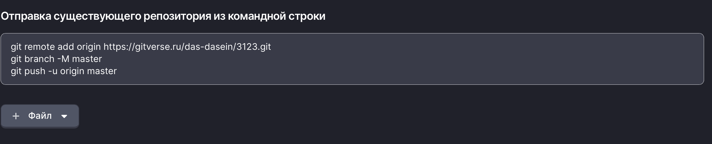

## Появление Git
Git был создан [Линусом Торвальдсом](https://github.com/torvalds) в 2005 году для управления разработкой ядра Linux. Основная мотивация для создания Git заключалась в необходимости иметь эффективный и надёжный инструмент для управления большим количеством изменений от большого числа разработчиков, работающих над ядром Linux. До появления Git файлы отправлялись Линусу по электронной почте, что становилось всё менее удобным с ростом числа участников проекта. Линус просматривал присланные файлы, и, если они ему нравились, включал их в свою версию ядра. Далее он периодически выкладывал обновленную версию ядра по FTP. 

Версия программного обеспечения - конкретное состояние кода в определённый момент времени.

FTP - это протокол для передачи файлов между компьютерами в сети. 

Таким образом, команде разработки Linux требовался инструмент, который мог бы эффективно управлять большим количеством изменений от множества разработчиков, обеспечивая при этом высокую производительность и надёжность.

Система контроля версий - это инструмент, который помогает разработчикам отслеживать изменения в коде, управлять версиями и сотрудничать с другими участниками команды. Система контроля версий позволяет сохранять историю изменений, возвращаться к предыдущим версиям и разрешать конфликты при одновременной работе нескольких разработчиков над одним проектом.

- **Отслеживание изменений**: СКВ сохраняет все изменения, внесённые в код, включая дату, время и автора изменений.
- **Ветвление и слияние**: Позволяет создавать отдельные версии программы для разработки новых функций или исправления ошибок, а затем объединять их с основной версией.
- **Совместная работа**: Обеспечивает возможность нескольким разработчикам работать над одним проектом одновременно, минимизируя конфликты.
- **Резервное копирование**: Хранит историю изменений, что позволяет восстановить предыдущие версии кода в случае необходимости.

Команда разработки Linux использовала систему контроля версий BitKeeper, которая была проприетарной (закрытой) и имела ограничения на использование. В 2005 году компания, владеющая BitKeeper, изменила условия использования, что побудило Линуса создать собственную систему контроля версий, которая была бы бесплатной и открытой для всех. По словам Линуса, он написал Git за десять дней.

Open Source - это программное обеспечение, исходный код которого доступен для просмотра, изменения и распространения любым пользователем. Git, будучи Open Source, позволил разработчикам по всему миру вносить улучшения и адаптировать его под свои нужды.


- Первый коммит https://github.com/git/git/commit/e83c5163316f89bfbde7d9ab23ca2e25604af290
   - Задание: найдите в первом коммите как расшифровывается "git" :)
- Интервью с Линусом Торвальдсом https://github.blog/open-source/git/git-turns-20-a-qa-with-linus-torvalds/

## А зачем и где мне пригодится Git?
Git полезен не только для профессиональных разработчиков, но и для студентов, изучающих программирование. Вот несколько причин, почему стоит изучить Git:

- **Управление проектами**: Git помогает организовать и управлять проектами, даже если вы работаете над ними в одиночку.
- **История изменений**: Вы всегда можете вернуться к предыдущей версии вашего кода, если что-то пойдёт не так.
- **Совместная работа**: Git облегчает совместную работу над кодом. (Такие лабораторные тоже бывают :) )
- **Профессиональный рост**: Знание Git является важным навыком для большинства вакансий в области разработки программного обеспечения.
- **Портфолио**: Использование Git и платформ, таких как GitHub, позволяет создавать портфолио ваших проектов, что может быть полезно при поиске работы.
- **Сохранность кода**: Git позволяет хранить ваш код в удалённых репозиториях, что защищает его от потери из-за сбоев оборудования или других проблем.

Если посмотреть рынок вакансий, то можно заметить, что знание Git является практически обязательным требованием для большинства позиций, связанных с разработкой программного обеспечения. Это относится не только к позициям разработчиков, но и к ролям, связанным с тестированием, управлением проектами и даже технической документацией, аналитикой.

## Установка Git
Через CLI (командную строку):
```sh
winget install --id Git.Git -e --source winget
```

Руками:
1. Перейдите на официальный сайт Git: [https://git-scm.com/](https://git-scm.com/)
2. Скачайте установочный файл для вашей операционной системы (Windows, macOS, Linux).
3. Запустите установочный файл и следуйте инструкциям мастера установки.
4. После установки откройте терминал (командную строку) и введите команду `git --version`, чтобы проверить успешность установки.

## Основные понятия Git
- **Репозиторий (repository)**: Хранилище для вашего проекта, содержащее все файлы и историю изменений.
- **Коммит (commit)**: Снимок текущего состояния файлов в репозитории. Фиксация изменений в репозитории — своего рода «точка сохранения».
- **Ветка (branch)**: Отдельная линия разработки, позволяющая работать над новыми функциями или исправлениями без влияния на основную ветку.
- **Слияние (merge)**: Процесс объединения изменений из одной ветки в другую.

## Основные команды Git
[Git Cheat Sheet](https://training.github.com/downloads/ru/github-git-cheat-sheet/) - Шпаргалка по основным командам Git.

- `git init`: Инициализация нового репозитория Git в текущей директории.
- `git clone <url>`: Клонирование удалённого репозитория на локальную машину.
- `git add <file>`: Добавление изменений в индекс для последующего коммита.
- `git commit -m "message"`: Фиксация изменений с сообщением.
- `git status`: Просмотр текущего состояния репозитория.
- `git log`: Просмотр истории коммитов.

## Ресурсы для изучения Git и СКВ
1. [Pro Git Book](https://git-scm.com/book/en/v2) - Бесплатная книга по Git.
2. [GitHub Learning Lab](https://lab.github.com/) - Интерактивные курсы по Git и GitHub.
3. [Learn Git Branching](https://learngitbranching.js.org/) - Визуальный интерактивный учебник по ветвлению в Git.

## Практика
1. Создайте папку для вашего проекта.
2. Инициализируйте новый репозиторий Git с помощью команды `git init`. 
2.1 Задайте имя пользователя и email (один раз):
```sh
git config --global user.name "Student IVT"
git config --global user.email "student.ivt@example.com"
```
3. Создайте файл `about_me.txt` и добавьте ваши ФИО.
4. Добавьте файл в индекс с помощью команды `git add about_me.txt`.
5. Сделайте первый коммит с помощью команды `git commit -m "First commit"`.
6. Измените файл `about_me.txt`, добавив информацию о вашей любимой книге.
7. Просмотрите статус репозитория с помощью команды `git status`.
8. Посмотрите изменения с помощью команды `git diff`.
9. Добавьте изменения в индекс с помощью команды `git add about_me.txt` и сделайте новый коммит.
10. Посмотрите историю коммитов с помощью команды `git log`.
11. Создайте новую ветку с помощью команды `git branch my-favourite-song`.
12. Переключитесь на новую ветку с помощью команды `git checkout my-favourite-song`.
13. Внесите изменения в файл `about_me.txt` и сделайте коммит в новой ветке.
14. Переключитесь обратно на основную ветку с помощью команды `git checkout main`.
15. Посмотрите содержимое файла `about_me.txt`, чтобы убедиться, что изменения из новой ветки не повлияли на основную ветку.
16. Слейте изменения из новой ветки в основную с помощью команды `git merge my-favourite-song`.
17. Посмотрите историю коммитов, чтобы убедиться, что изменения были успешно слиты.
18. Удалите содержимое файла `about_me.txt`. Сохраните изменения. Запустите git diff, git status.
19. Восстановите последнее сохраненное состояние файла командой `git restore`.
20. Проверьте содержимое файла, чтобы убедиться, что изменения были отменены.
21. Создайте новую ветку с именем `my-favourite-movie` и переключитесь на неё.
22. Внесите изменения в файл `about_me.txt`, добавив информацию о вашем любимом фильме, и сделайте коммит.
23. Переключитесь обратно на основную ветку.
24. Сделайте изменения в файле `about_me.txt`, добавив информацию о вашем любимом сериалe, и сделайте коммит.
25. Слейте изменения из ветки `my-favourite-movie` в основную ветку.
26. Конфликты слияния (merge conflicts) возникают, когда один и тот же участок кода был изменён в двух разных ветках (например, main и my-favourite-movie), и Git не может автоматически решить, какую версию сохранить. В этом случае Git помечает конфликтные участки в файлах, и разработчик должен вручную выбрать, какие изменения оставить.
27. Разрешите конфликты слияния в файле `about_me.txt`.


## Git и GitHub
GitHub - это веб-сервис для хостинга репозиториев Git, который предоставляет дополнительные функции, такие как управление проектами, совместная работа и интеграция с другими инструментами. GitHub позволяет разработчикам легко делиться своим кодом, сотрудничать с другими и управлять проектами. При работе с GitHub используются удалённые репозитории, которые хранятся на серверах GitHub.

Github - не единственный сервис для хостинга репозиториев Git. Еще существуют:
- GitLab - [https://gitlab.com/](https://gitlab.com/)
- Bitbucket - [https://bitbucket.org/](https://bitbucket.org/)
- GitVerse - [https://gitverse.ru/](https://gitverse.ru/)

### 1. Локальный репозиторий (ваша рабочая копия)

Это полная копия истории проекта, хранящаяся на вашем личном компьютере. Когда вы вносите изменения в файлы, фиксируете (коммитите) их, вы делаете это в своём локальном репозитории. (С ним мы уже познакомились в предыдущих шагах.)

### 2. Удалённый репозиторий (GitHub)

Удалённый репозиторий — это общая, каноническая версия проекта, которая обычно размещена на таком сервисе, как GitHub.
**`origin`** — это стандартное имя-псевдоним (**alias**), которое Git автоматически присваивает основному удалённому репозиторию при выполнении команды `git clone`. Таким образом, `origin` **является просто коротким именем** для длинного URL-адреса вашего репозитория на GitHub.
Он действует как центральный узел, который:
* **Хранит** окончательную версию проекта.
* **Служит** точкой обмена для всех участников команды.

### 3. Основные механизмы синхронизации

Связь между ними поддерживается с помощью следующих ключевых команд, которые по умолчанию взаимодействуют с `origin`:

| Команда | Направление | Описание |
| :--- | :--- | :--- |
| **`git clone [URL]`** | Удалённый -> Локальный | Создаёт **новую** локальную копию, и автоматически называет исходный удалённый репозиторий **`origin`**. |
| **`git push`** | Локальный -> Удалённый | Отправляет ваши **локальные коммиты** из указанной ветки на удалённый репозиторий, который называется **`origin`**. |
| **`git fetch`** | Удалённый -> Локальный | **Узнает** сведения о последних изменениях и коммитах. |
| **`git pull`** | Удалённый -> Локальный | Объединяет изменения в ваш локальный репозиторий. |

---

## Домашнее задание
В зависимости от того, наблюдаются ли у вас проблемы с прохождением капчи, выполните задание для GitHub или Gitverse.
Предварительно в любом случае скачайте и установите Git на ваш компьютер.

### Github
1. Создайте аккаунт на GitHub, если у вас его ещё нет.
2. Создайте репозиторий на GitHub. Имя репозитория должно характеризовать его содержимое!
3. Скачайте и установите GitHub CLI.
Через CLI (командную строку):
```sh
winget install --id GitHub.cli
```
Руками:
- https://github.com/cli/cli/releases/tag/v2.81.0
- Скачайте установочный файл для вашей операционной системы (Windows, macOS, Linux). (Их список чуть ниже в разделе Assets)
- Запустите установочный файл и следуйте инструкциям мастера установки.

Откройте терминал, введите команду `gh auth login` и следуйте инструкциям для авторизации через ваш аккаунт GitHub.

### Gitverse
1. Создайте аккаунт на [GitVerse](https://gitverse.ru/), если у вас его ещё нет.
   - Вход в сервис
   - Войти
   - Зарегистрироваться
2. Создайте репозиторий на GitVerse. Имя репозитория должно характеризовать его содержимое!
3. Перейдите в [настройки вашего аккаунта на GitVerse](https://gitverse.ru/settings/account). Создайте пароль. Используйте его позже при выполнении команды `git push`.

### Общие шаги для GitHub и GitVerse
1. Выберите любую лабораторную работу из семестра, которую вы готовы опубликовать. Инициализируйте локальный репозиторий Git командой `git init` (Команду запускать из папки с вашей лабораторной работой!).
2. Добавьте файлы в отслеживаемые/готовые для коммита командой `git add *`, сделайте коммит. Если вы делаете коммит на данном устройстве впервые (и не представлялись Git ранее), то вас попросят ввести имя пользователя и email (читайте подсказки в терминале).
3. При переходе в пустой репозиторий на GitHub или GitVerse вам будут предложены команды для отправки вашей локальной копии. Ваша задача состоит в том, чтобы их выполнить.

4. При использовании GitVerse на шаге `git push` вас попросят ввести логин и пароль (пароль вы создали на шаге 3 для GitVerse). Введите его.
   Для Github вы уже авторизовались через GitHub CLI на шаге 4 в разделе Github.
5. Ссылку на ваш репозиторий отправьте в [форму](https://forms.gle/6gDznwbSihqhcqju5).


## Клиенты Git
Необязательно всегда использовать командную строку для работы с Git. Существуют графические клиенты, которые предоставляют удобный интерфейс для управления репозиториями. Вот несколько популярных клиентов Git:
- **GitHub Desktop**: Официальный клиент от GitHub, который упрощает работу с репозиториями на GitHub.
- **Sourcetree**: Бесплатный клиент от Atlassian, поддерживающий Git и Mercurial.
- **TortoiseGit**: Клиент для Windows, интегрированный с проводником Windows.
- **Интегрированные в среды разработки инструменты**: Популярные IDE (IntelliJ IDEA, Visual Studio, VS Code) имеют встроенную поддержку Git, что позволяет выполнять большинство операций прямо из среды разработки. Так как вы используете Visual Studio, то можете использовать [встроенные инструменты для работы с Git](https://learn.microsoft.com/ru-ru/visualstudio/version-control/git-with-visual-studio?view=vs-2022).